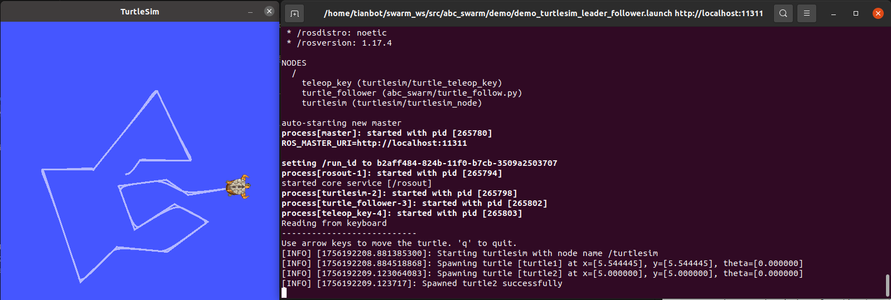
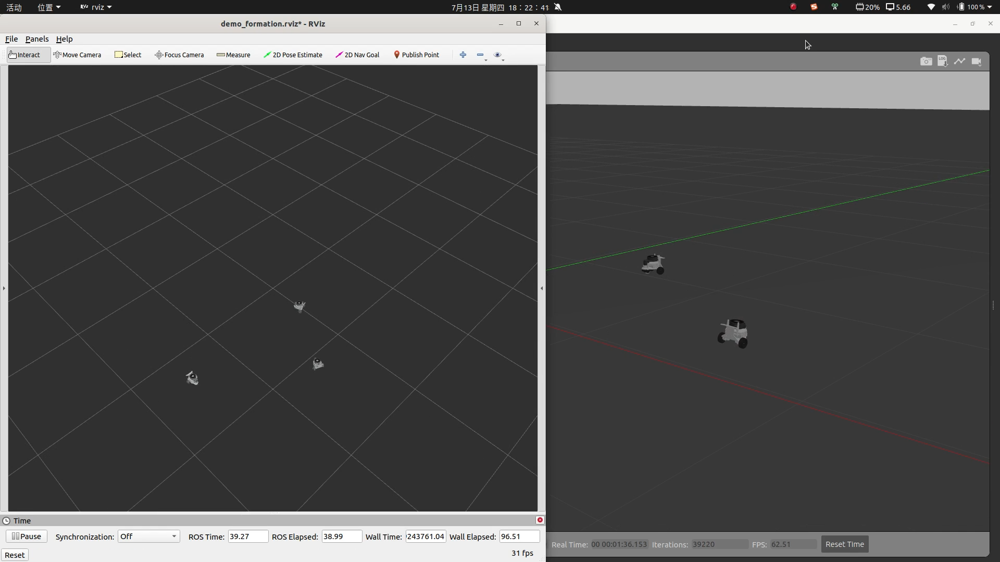

Simulation
==========

Leader-Follower of Turtlesim
-----------------------------

.. code-block:: bash

   roslaunch abc_swarm demo_turtlesim_leader_follower.launch

then, you can use the arrow on keyboard in terminal to control the leader turtle1 and follower turtle2

Leader-Follower of Three Tianbot Mini in Gazebo
-----------------------------------------------

.. code-block:: bash

   roslaunch abc_swarm demo_sim_tbmn_formation.launch                               # termianl 1

- with teleop_twist_keyboard

.. code-block:: bash

   rosrun teleop_twist_keyboard teleop_twist_keyboard.py cmd_vel:=/tbmn_01/cmd_vel  # termianl 2

- with pure pursuit tarcking

.. code-block:: bash
   
   roslaunch abc_swarm demo_leader_pure_pursuit.launch  robot_name:=tbmn_01         # termianl 2
